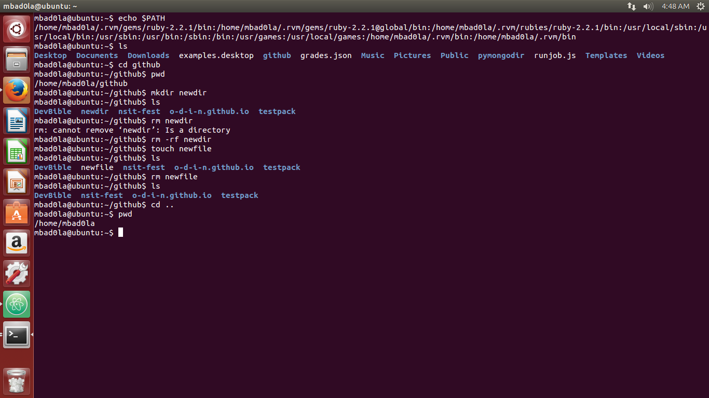

# DevBible
Some Holy Sermons from The Dev Community

### Dev.initialise()
Welcome to the world of development! Enough formalities...

It's time you falsified some of the Memes about what people think Software Engineers do and what you actually do.  
Time for them Terminals; your best bud to-be.

Sadly terminals need an OS to run on (bummer) and as we at ODIN are obsessed with Open-Source softwares, you've got to try out [Linux](http://www.linuxfoundation.org/what-is-linux).  
We suggest everyone who intends to do development to give any Linux distribution a try. You will definitely be surprised by how efficient things can be for us devs through a terminal.

One may find OSX as an option as well for setting up development environments(OSX is pretty badass),  
but then many Linux distros are **FREE**.  
So, if you want to shell out **some** bucks on an Apple product, go for it!  
The debate for OSX vs Linux makes for many interesting reads, as you might find it [here](http://www.infoworld.com/article/2947684/linux/os-x-versus-linux-which-is-more-practical.html).

##### Let's get them Linux distros
Due to the open-sourced nature of the Linux kernel, it's raining distributions out there. So many forks and flavours.  
All this may overwhelm a person trying to get into operating a Linux distro.  
Depending on how much comfortable you are(read "Swag Level") and your requirements, [this article on lifehacker.com](http://lifehacker.com/5773667/pick-the-right-linux-flavor-for-you) sheds some light on the most popular distros available.  
Personally, [Ubuntu](http://www.ubuntu.com/desktop) is the best bet for getting a balanced Linux experience and is not at all uneasy for people used to Windows.

You maybe wondering why Linux distros only? Isn't Windows compatible with development things?
This is not the real case because once you start working on Ubuntu you will find it to be a Developer friendly OS while Windows was a User friendly one. You can find more differences [here on askubuntu.com](http://askubuntu.com/questions/360161/what-advantages-does-ubuntu-have-over-windows-as-an-environment-for-programming)

New Operating System, New Environment and probably new rules too? Yeah, But Let's start with these baby steps.
- How to install Ubuntu?
- Setup Dual boot with Windows
- Customization
- Basic Terminal Commands

##### How to install Ubuntu?
Personally we recommend you to install Ubuntu 14.04(Trusty Tahr) although the latest release is 15.04, as we've had some bad experiences with that version.
- Get [Disc Image](https://en.wikipedia.org/wiki/Disk_image) from [ubuntu.com](http://www.ubuntu.com/download)

At this point of time, You have the Ubuntu's installer. Now you need to decide whether you want to install it in your Host PC or in your [virtual PC](https://en.wikipedia.org/wiki/Virtual_machine).
We recommend to go with virtual machine first if you are not sure what you are doing.
- Get [VMware](https://my.vmware.com/web/vmware/downloads)
- Create a new virtual machine and install Ubuntu, [Tutorial](https://www.youtube.com/watch?v=Lv6V6ESOyUk)

All went good? Installed Successfully? If not, check out this [Troubleshooting Guide](https://help.ubuntu.com/lts/installation-guide/i386/ch05s04.html).

##### Setup Dual boot with Windows
Dual boot facilitates you to install Ubuntu alongside Windows on your system, allowing you to choose the OS on which you want your system to boot on. Dual boot is usually not recommended because many a times it leads to complications. It is always better to run Ubuntu on a virtual machine if you want to keep using Windows along with your preferred Linux distro.  
The following links might help you get your system setup for a dual boot operation -  
* <http://www.dedoimedo.com/computers/dual-boot-windows-8-ubuntu.html>
* <http://askubuntu.com/questions/343268/how-to-use-manual-partitioning-during-installation>
* <http://askubuntu.com/questions/235862/what-are-the-partitions-to-create-if-i-want-to-dual-boot-ubuntu-12-10-with-windo>
* <https://help.ubuntu.com/community/WindowsDualBoot>

##### Basic Terminal Commands
* `ls` : Lists all the items in the working directory (mentioned in the terminal prompt).
* `pwd` : pwd or print working directory does exactly what it means.
* `cd dir` : changes the working directory to _dir_. More about cd command [here](http://www.computerhope.com/unix/ucd.htm).

